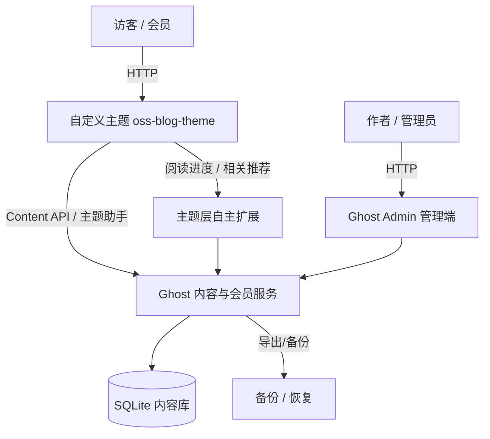

# OSS Blog — 开源个人博客系统二次开发

> 基于 [Ghost](https://github.com/TryGhost/Ghost) 开源博客平台，二次开发出一个**可注册、可写作、可评论、可搜索**的个人博客系统。本项目为《开源软件与新技术》实验 01 的交付成果。

## 1. 项目简介

以成熟开源项目 Ghost 为基线，不改动其核心（认证、编辑器、内容存储、会员、评论），只在**自定义主题层**做可辨识的二次开发，并实现一项自主功能——**按标签 + 阅读时长生成相关推荐**。

### 目标用户与问题场景

- **博主/写作者**：需要一个开箱即用、但界面与功能有个人辨识度的博客。
- **读者/会员**：可注册登录、按标签浏览、评论互动、按关键词搜索文章。
- **问题**：直接使用 Ghost 默认主题缺乏个人特色，且缺少"读完一篇后按相关性继续阅读"的引导。

### 功能清单

| 模块 | 能力 |
|------|------|
| 身份 | 会员注册 / 登录，错误登录有明确提示；管理员 + 普通会员两类账号 |
| 内容 | 管理员发布 / 编辑文章，文章关联标签，按标签浏览 |
| 评论 | 符合权限的会员可评论，权限受控 |
| 搜索 | 关键词命中标题/正文并跳转，无结果有提示 |
| 主题 | 自定义导航、文章卡片、详情页元数据，桌面 + 窄屏自适应 |
| 自主功能 | **相关推荐**：按标签匹配 + 展示阅读时长，含空状态 |

## 2. 技术栈与架构

- **上游基线**：[TryGhost/Ghost](https://github.com/TryGhost/Ghost) `v6.62.0`（commit `d4fbd04045`），MIT 许可
- **主题基底**：[TryGhost/Casper](https://github.com/TryGhost/Casper) `v5.12.3`，MIT 许可
- **运行环境**：Node.js `22.23.1`、Ghost CLI `1.32.3`、SQLite、Handlebars 主题引擎
- **存储**：SQLite（本地内容库），与源代码分离



**改动边界**：只改 `theme/oss-blog-theme/`（主题源码 + 样式 + 模板），不改 `runtime/`（Ghost 运行时）与 Ghost 核心源码。运行数据（数据库、日志、密钥）一律不进 Git。

## 3. 环境要求

| 依赖 | 版本 | 校验命令 |
|------|------|----------|
| Node.js | `22.23.1`（`^22.23.1 \|\| ^24.20.0`） | `node --version` |
| npm | 随 Node 附带 | `npm --version` |
| Ghost CLI | `1.32.3` | `ghost --version` |
| 操作系统 | Windows 11 / Linux / macOS | — |

**注意**：本项目锁定的 Node 版本为 `22.23.1`，请勿使用 `22.14.0` 等过低版本（不满足 `^22.23.1`）。

## 4. 快速开始

```bash
# 1. 安装 Node 22.23.1（使用 nvm）
nvm install 22.23.1 && nvm use 22.23.1

# 2. 安装 Ghost CLI
npm install -g ghost-cli@latest
ghost --version   # 应输出 1.32.3

# 3. 初始化 Ghost 运行时（runtime/ 必须为空）
cd oss-blog/runtime
ghost install local
ghost ls

# 4. 浏览器打开管理端，完成管理员初始化
#    http://localhost:2368/ghost
```

### 停止 / 启动

```bash
cd oss-blog/runtime
ghost stop
ghost start
```

## 5. 主题安装与回滚

```bash
# 安装主题
cd theme/oss-blog-theme
npm install          # 安装 gulp / gscan 等
npm run zip          # 打包为 oss-blog-theme.zip

# 在管理端 Settings → Design 上传 zip 并激活；
# 或命令行安装到 runtime：
#   cp oss-blog-theme.zip ../runtime/content/themes/
#   cd ../runtime && ghost theme ... 
```

**回滚**：管理端切换回默认主题 Casper 即可；源码始终保留在 `theme/oss-blog-theme/`。

**主题校验**：

```bash
cd theme/oss-blog-theme
npm run test         # 运行 gscan 主题兼容性检查
```

## 6. 二次开发内容（与上游基线的差异）

| 位置 | 上游基线（Casper） | 本人改动 |
|------|-------------------|----------|
| 导航 `default.hbs` | 顶部导航 + 搜索按钮 | 新增**阅读进度条**（滚动进度），页脚新增主题署名 |
| 文章卡片 `partials/post-card.hbs` | 日期 + 阅读时长 + 评论数 | 新增**作者名**、**阅读时长徽章**（`oss-reading-badge`） |
| 详情页 `post.hbs` | 主标签 + 作者 + 日期 | 新增**全部标签 chips**（可点击）、**相关推荐面板** |
| 底部推荐 | 仅"最新 3 篇" | 改为**按主标签匹配**的相关推荐，展示阅读时长，含"暂无相关推荐"空状态 |
| 样式 | Casper 默认 | 新增 `assets/css/oss-blog.css`（卡片/徽章/进度条/推荐面板） |

## 7. 自主功能设计说明

**功能：相关推荐（按标签 + 阅读时长）**

- **用户故事**：读者读完一篇关于"前端"的文章后，希望直接看到同主题的其它文章，并了解每篇大概要读多久。
- **数据来源**：Ghost Content API（主题 `{{#get}}` 助手），按当前文章 `primary_tag` 过滤、排除当前文章、取 3 篇。
- **界面入口**：文章详情页底部"相关推荐"面板。
- **失败/空状态**：无同标签文章时显示"暂无相关推荐"。
- **隐私影响**：无——只在服务端按标签查询，不向浏览器暴露管理密钥。
- **为什么放主题层而不是改 Ghost 核心**：相关推荐属于展示层逻辑，用主题助手即可实现，避免破坏上游升级边界。

## 8. 测试

见 `tests/acceptance.md`，覆盖：功能测试（注册/登录/文章/标签/评论/搜索）、权限测试、界面测试、恢复测试。

```bash
# 主题自动化校验
cd theme/oss-blog-theme && npm run test
```

## 9. 数据导出与恢复

```bash
# 导出内容（管理端 Settings → Labs → Export，或 Content → Export）
# 得到 JSON 文件，恢复方法：
# 管理端 Settings → Labs → Import 上传导出文件
```

**演示账号生成**：在管理端 Members 页面创建普通会员账号；管理员账号在首次初始化时创建。**不提交真实密码**。

## 10. 安全注意事项

- `.env`、`config.production.json`、数据库、日志、导出文件均在 `.gitignore` 中排除。
- 管理密钥、数据库口令**绝不**写入 Git 或前端代码。
- 若误提交密钥，立即轮换并从历史中清理，不能只追加忽略规则。

## 11. 上游与第三方资源

| 资源 | 来源 | License |
|------|------|---------|
| Ghost | https://github.com/TryGhost/Ghost | MIT |
| Casper 主题 | https://github.com/TryGhost/Casper | MIT |
| 图标（search/fire/lock/avatar 等） | 随 Casper 主题 | MIT |

详见 `NOTICE.md`。

## 12. 个人开发记录

- 基线：固定 Ghost `v6.62.0`、Casper `v5.12.3`，Node `22.23.1`。
- 分支：`feature/blog-enhancement`，≥5 个非合并 commit，1 个 PR + 自审记录。
- 提交记录覆盖：基线、核心功能、自主功能、测试、文档。
